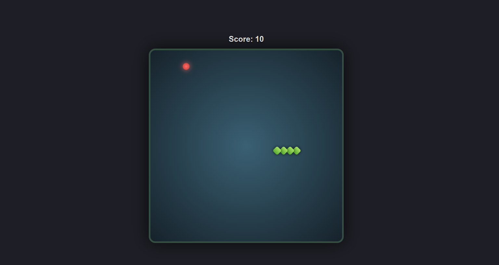

# Snake-game-js

Welcome to the Snake Game, a simple yet engaging browser-based game built using HTML, CSS, and JavaScript. This project offers a responsive design, smooth animations, and an intuitive user interface that makes it enjoyable to play.



## Live Demo
You can play the game online [here](https://snake-game-soumadip.netlify.app/).

## How to Play
- **Move the Snake:** Use the arrow keys on your keyboard to navigate the snake:
  - **Up Arrow:** Move up
  - **Down Arrow:** Move down
  - **Left Arrow:** Move left
  - **Right Arrow:** Move right
- **Objective:** Eat the food that appears in the game arena to grow your snake and increase your score.
- **Challenge:** Avoid running into the walls or your own tail, as this will end the game.
- **Increasing Difficulty:** The game speed increases each time the snake eats food, adding to the challenge.

## Features
- **Responsive Design:** The game adjusts smoothly to different screen sizes.
- **Dynamic Score Display:** Your score is updated in real-time as you play.
- **Increasing Difficulty:** The snake's speed increases progressively, making the game more challenging as you score higher.

## Installation
To play the game locally, follow these steps:
1. Clone this repository:
   ```bash
   git clone https://github.com/soumadip-dev/snake-game-js.git
   ```
2. Navigate to the project directory:
   ```bash
   cd snake-game-js
   ```
3. Open the `index.html` file in your browser to start the game.

**Enjoy the game and have fun! 🎮**
